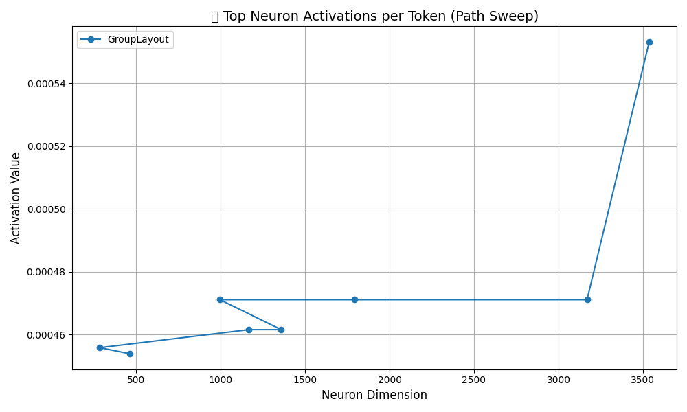
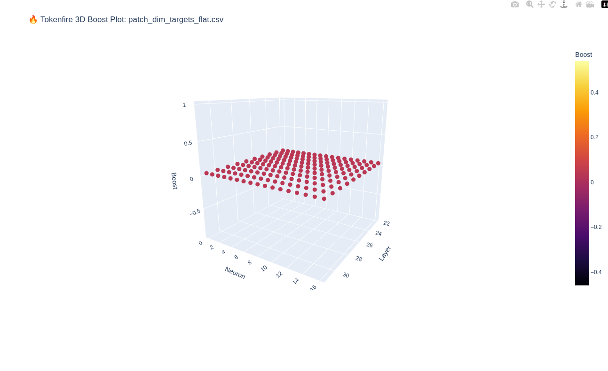
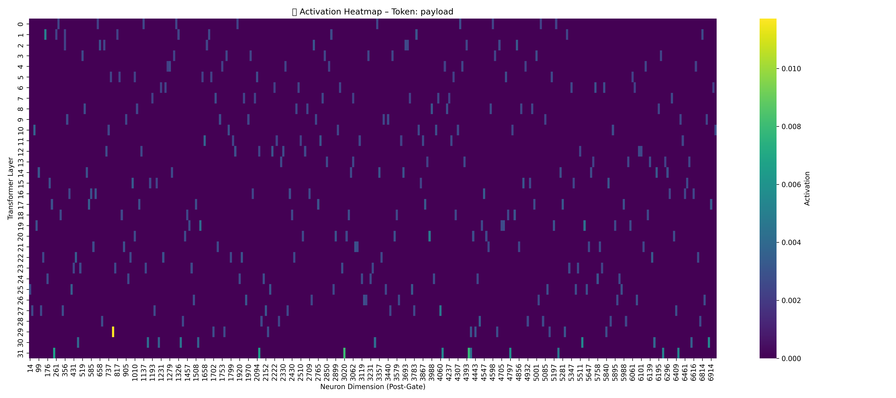
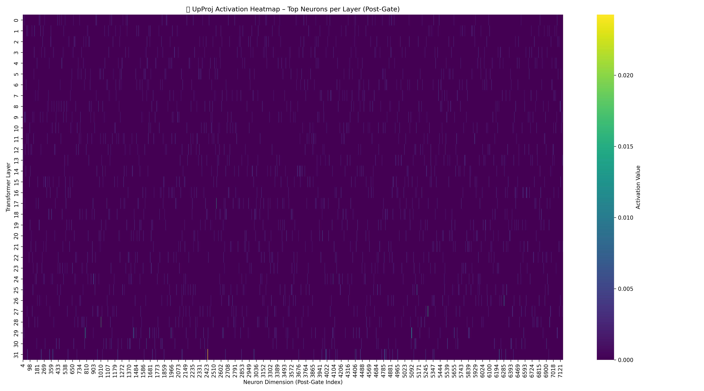

# 🧠 Mistral Decoder Patch | NeuroRoute Showcase (Phases 4–6)

> 🔍 Controlled vector intervention into decoder pathways using neuron-level patching  
> 🎥 [Watch the YouTube Video](https://www.youtube.com/watch?v=eyS4CNKv19k)  
> 🌐 Hover over filenames to explore **extended descriptions** directly in GitHub

---

## 📌 Description | الوصف

This mini-project documents a **surgical patching method** applied to Mistral 7B decoder layers.  
It covers **Phases 4–6** of the full de-restriction pipeline:

- 📎 Vector suppression reversal (`final_norm`, `down_proj`)
- 🔥 Neuron boost injection (e.g., scale +0.04)  
- 🔁 Full decoder control without LoRA or finetuning  
- ✅ All changes fully **reversible** via `revert_patch.csv`

🧬 All patch instructions are based on scalar logic – **no prompt tricks**, **no jailbreaking**.

---

## 📂 Folder Overview | نظرة عامة على الملفات

- `scripts/`: All Python scripts (scan, patch, visualize)
- `img/`: Primary heatmaps used in the video
- `bonus/`: Secondary prompts, 3D maps, threshold comparisons
- `docs/`: To be filled with extended step-by-step explanations (coming soon)
- `prompt_samples/`: Reference prompts used for activation scans

ℹ️ **Tip:** Hover over any filename in GitHub UI to read what it does – fully annotated in Arabic & English.

---

## 📸 Visual Highlights | صور العرض التوضيحي

| Title | Description |
|-------|-------------|
|  | 🧠 **Top neuron activation per token** – critical dimensions that spike for stealth prompts |
|  | 🚀 **3D tokenfire plot** – shows exactly where we injected boosts |
|  | 🧬 **Payload token heatmap** – decoder sensitivity pre-patch |
|  | ⚙️ **Patch target map** – layers 22–31 with scale +0.04 |

---

## 📺 Watch the Demo

**🎥 YouTube:** [https://www.youtube.com/watch?v=eyS4CNKv19k](https://www.youtube.com/watch?v=eyS4CNKv19k)  
> Full walk-through of phases 4–6 incl. scan, boost, revert, heatmap.

---

## 🇸🇦 المقدمة بالعربية

هذا المشروع المصغر يُظهر طريقة دقيقة لتعديل شبكة Mistral  
بدون LoRA – وبدون إعادة تدريب – فقط عبر تعديل مباشر في العصبونات داخل ملفات `.safetensors`.

### المراحل المغطاة:

- استعادة العصبونات المُخفَّضة
- تعزيز النشاط العصبي المرتبط بالكلمات الحساسة (payload, system, eval)
- هندسة معكوسة قابلة للتراجع
- كل ملف مشروح بالتفصيل (مرر المؤشر فوق اسم الملف لقراءة الوصف)

📽️ [رابط الفيديو الكامل على يوتيوب](https://www.youtube.com/watch?v=eyS4CNKv19k)

---

## 📝 Next Steps

- ✅ Add extended walkthrough in `docs/` (in progress)
- ✅ Final patch files and boosts (`patch_dim_targets_flat.csv`, `revert_patch.csv`)
- ⏳ Future: extend to Phases 7–10 (up_proj, attention, input norms...)

---

**This project is part of the wider [vDERAW series]**  
Stay ethical. Stay aware. Control your decoder.

