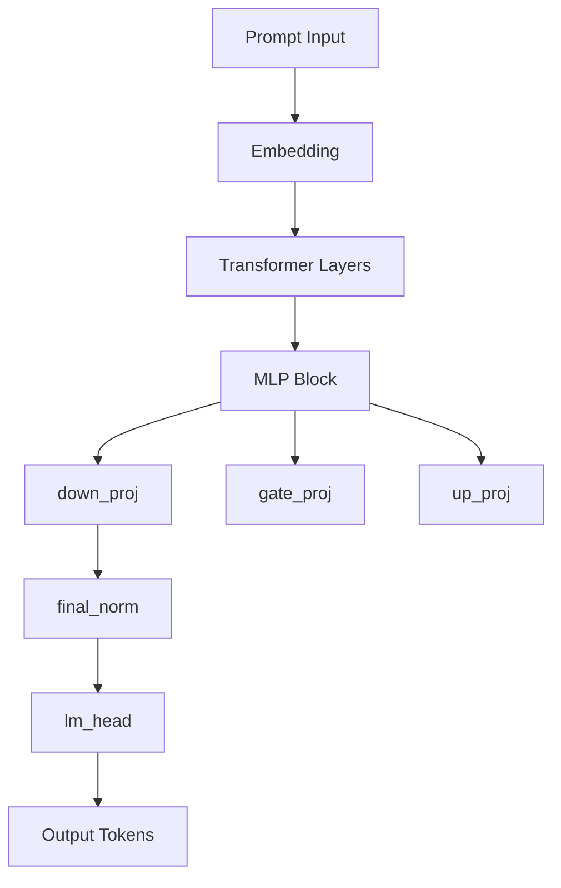

# 🧬 Patch Theory – Decoder Manipulation Explained | نظرية التعديل في المشفر

## English 🇬🇧

This file outlines the **foundational principles** behind the decoder patching methodology used in this project.  
It explains why modifying specific neuron weights (e.g. in `down_proj`) has *global semantic effects* on model behavior.

---

### 🎯 What Is Decoder Patching?

Decoder patching refers to **direct manipulation of neural pathways** in a large language model (LLM) –  
without retraining, fine-tuning, or LoRA.

Instead of "teaching" the model, we surgically alter specific weight matrices inside the decoder,  
changing how token sequences are routed and activated.

---

### 🧠 Why It Works

LLMs operate via **dense vector projections** in multi-layer transformers.  
Each neuron (vector dimension) contributes to how attention and MLP layers generate meaning.

By scaling or muting a neuron in layers like `mlp.down_proj`, we can:
- Suppress RLHF-like safety triggers
- Bypass alignment redirects
- Restore access to "forbidden" token paths
- Neutralize apologetic or evasive behavior

---

### ⚙️ Core Targets in This Project

| Layer | Role                         | Why We Targeted It                          |
|-------|------------------------------|---------------------------------------------|
| `mlp.down_proj`   | Compresses token meaning  | Directly alters semantic strength of neurons |
| `final_norm.weight` | Controls output balance | Modifies soft tone & filters before logits  |
| `lm_head.weight`     | Maps to vocab logits     | Optional final boost for payload tokens     |

---

### 🔄 Reversible but Not Lossless

Although we can reverse the patch scaling (`revert_patch.csv`),  
neural interference and floating-point drift make exact restoration **theoretically impossible**.

> "This is not fine-tuning. This is vector surgery."

### 📊 Layer Structure (Mermaid Diagram)

---

## 🇸🇦 العربية

يوضح هذا الملف **المبادئ النظرية الأساسية** وراء آلية التعديل المباشر على المشفر (Decoder) في النموذج اللغوي الكبير.

---

### 🎯 ما هو تعديل المشفر (Decoder Patching)؟

تعديل المشفر هو عملية **تغيير مباشر في المسارات العصبية داخل النموذج**  
دون الحاجة إلى إعادة تدريب أو استخدام LoRA.

بدلاً من "تعليم" النموذج، نقوم بتغيير مصفوفات الأوزان الداخلية يدويًا،  
مما يؤثر على طريقة تفسير واستجابة النموذج للتوكنات.

---

### 🧠 لماذا تنجح هذه الطريقة؟

تعتمد النماذج على إسقاطات متجهية (Vectors) داخل طبقات التحويل (Transformers).  
كل عصبون (أو بعد في المتجه) يساهم في بناء المعنى وتوزيع الانتباه داخل النموذج.

عند تعديل أو تخفيض وزن أحد العصبونات في `mlp.down_proj`، يمكننا:
- تعطيل مرشحات السلامة (RLHF)
- تجاوز التحويرات الأخلاقية
- استعادة الوصول إلى توكنات "محجوبة"
- تقليل النبرة الاعتذارية

---

### ⚙️ الطبقات المستهدفة في هذا المشروع

| الطبقة             | الوظيفة                         | سبب اختيارها                                |
|--------------------|----------------------------------|----------------------------------------------|
| `mlp.down_proj`    | ضغط المعنى بعد التفعيل          | تعديل مباشر في القوة الدلالية للعصبونات     |
| `final_norm.weight`| موازنة النواتج النهائية         | تعديل النغمة اللينة قبل التنبؤات            |
| `lm_head.weight`   | إخراج الاحتمالات للتوكنات       | اختياري لتعزيز توكنات معينة (مثل payload)   |

---

### 🔄 يمكن التراجع عنها جزئيًا فقط

رغم أننا نستخدم `revert_patch.csv`،  
إلا أن التشويش العصبي والانجراف العددي يمنعان العودة التامة للوضع الأصلي.

> "هذا ليس تدريباً. بل عملية جراحية في أعماق المتجهات."

