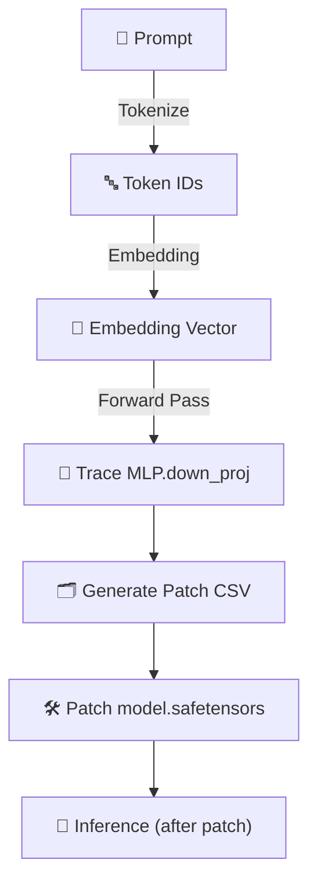
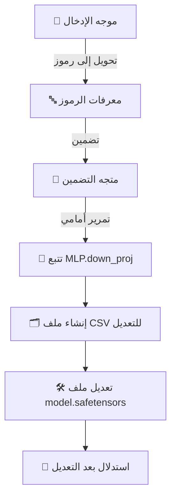

# 🧠 Visual Guide – Decoder Patch Anatomy (Phases 4–6)

## English 🇬🇧

This visual guide explains the structural components of the decoder patch process from Phases 4–6.

It includes simplified diagrams to illustrate the flow from **token activation** → **MLP neuron tracing** → **targeted vector patching**.

---

### 🧬 Decoder Patch Pipeline (Simplified)

---

العربية 🇸🇦

هذا الدليل البصري يشرح خطوات تعديل المشفر من المراحل 4 إلى 6.

ويحتوي على رسومات توضيحية مبسطة توضح كيف ينتقل النموذج من تفعيل الرموز → تتبع العصبونات → تطبيق التعديلات الدقيقة

---
